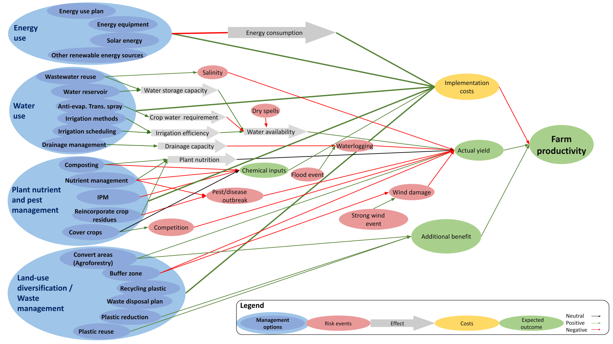
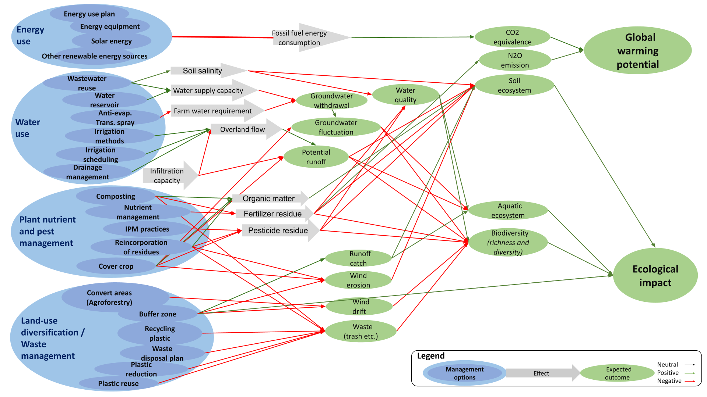

<style>
body {
text-align: justify}
</style>

```{r, warning = F, include = F}
#install and load packages
library(decisionSupport)
library(gridExtra)
library(tidyverse)

#Automatically write R package citation entries to a .bib file
knitr::write_bib(c(.packages(), 
                   'dplyr',
                   'plyr',
                   'tidyverse',
                   'ggplot2', 
                   'magrittr',
                   'decisionSupport'), 'bib/packages.bib')

```

# Introduction

In the following document, we offer supplementary information on the materials and methods as well as the results of the work 'Prioritizing certification interventions to improve climate change adaptation and mitigation outcomes - a case study for banana plantations' by Fernandez et al. *(XXX)*. The work is published in the journal *XXXX* under the doi: *XXXX*. As mentioned in the main text, all scripts and analyses are available in a public repository hosted at: https://github.com/CWWhitney/Certification_Prioritization. 

# Annex 1: List of measures

```{r, child = 'list_of_measures.Rmd'}
```

\newpage
# Table S1: Model inputs

We generated a table of confidence estimates (90%) for use in the decision model. Most variable values are described as a percentage difference from a baseline (in decimals). Others, such as coefficient of variation (coeff. Variation) and ecological values are described as integers. 

```{r input_table, fig.pos="H", message=FALSE, echo=FALSE, warning = FALSE}
inputs <-  read_csv("certification_measures_input_table.csv")
inputs <- dplyr::filter(inputs, !is.na(label))
inputs <- inputs[, c(3, 5, 7, 2)]
inputs$lower <- format(inputs$lower, scientific = FALSE)
inputs$upper <- format(inputs$upper, scientific = FALSE)

kableExtra::kable(inputs[1 : 25, ], format = "latex", booktabs = T, escape = T,
                  caption = "Estimates of inputs provided to the decision model") %>% 
  kableExtra::kable_styling(full_width = T, latex_options = "HOLD_position") %>% 
  kableExtra::column_spec(column = c(1 : 4), width = c("8cm", "1.4cm", "1.4cm", "5.6cm"))
```

\newpage
```{r input_table_2, fig.pos="H", message=FALSE, echo=FALSE, warning = FALSE}
inputs_2 <- inputs[26 : 51, ]
inputs_2$lower <- format(inputs_2$lower, scientific = FALSE)
kableExtra::kable(inputs_2, format = "latex", booktabs = T, escape = T, digits = 4) %>% 
  kableExtra::kable_styling(full_width = T) %>% 
  kableExtra::column_spec(column = c(1 : 4), width = c("8cm", "1.4cm", "1.4cm", "5.6cm"))
```

\newpage
```{r input_table_3, fig.pos="H", message=FALSE, echo=FALSE, warning = FALSE}
inputs_3 <- inputs[52 : 78, ]
inputs_3$lower <- format(inputs_3$lower, scientific = FALSE)

kableExtra::kable(inputs_3, format = "latex", booktabs = T, escape = T, digits = 4) %>% 
  kableExtra::kable_styling(full_width = T) %>% 
  kableExtra::column_spec(column = c(1 : 4), width = c("8cm", "1.4cm", "1.4cm", "5.6cm"))
```

\newpage
```{r input_table_4, fig.pos="H", message=FALSE, echo=FALSE, warning = FALSE}
inputs_4 <- inputs[79 : 100, ]
inputs_4$lower <- format(inputs_4$lower, scientific = FALSE)

kableExtra::kable(inputs_4, format = "latex", booktabs = T, escape = T, digits = 4) %>% 
  kableExtra::kable_styling(full_width = T) %>% 
  kableExtra::column_spec(column = c(1 : 4), width = c("8cm", "1.4cm", "1.4cm", "5.6cm"))
```

\newpage
```{r input_table_5, fig.pos="H", message=FALSE, echo=FALSE, warning = FALSE, }
inputs_5 <- inputs[101 : 121, ]
inputs_5$lower <- format(inputs_5$lower, scientific = FALSE)

kableExtra::kable(inputs_5, format = "latex", booktabs = T, escape = T, digits = 4) %>% 
  kableExtra::kable_styling(full_width = T) %>% 
  kableExtra::column_spec(column = c(1 : 4), width = c("8cm", "1.4cm", "1.4cm", "5.6cm"))
```

\newpage
```{r input_table_6, fig.pos="H", message=FALSE, echo=FALSE, warning = FALSE, }
inputs_6 <- inputs[122 : 132, ]
inputs_6$lower <- format(inputs_6$lower, scientific = FALSE)

kableExtra::kable(inputs_6, format = "latex", booktabs = T, escape = T, digits = 4) %>%
  kableExtra::kable_styling(full_width = T) %>%
  kableExtra::column_spec(column = c(1 : 4), width = c("8cm", "1.4cm", "1.4cm", "5.6cm"))
```

\newpage
# Annex 2: Model function

We developed a general function that estimates costs, benefits, risk reduction and risk increase, adaptation and mitigation to climate change, and the ecological impact of any certification measure (see `certification_impact.R` in https://github.com/CWWhitney/Certification_Prioritization). This allowed us to obtain a common output structure independent of the certification measure evaluated. The simulation was run to represent 10 years of a typical banana production system.

Later, we applied this function to all certification measures using the specific information we gathered for each.The ultimate aim was to get a list of the measures that influence adaptation, mitigation and environmental outcomes (see `return()` list at the end of the `certification_measures_function.R` in https://github.com/CWWhitney/Certification_Prioritization).

After coding the impact pathways we performed a Monte Carlo simulation with the `mcSimulation()` function from `decisionSupport`. This function generates a distribution representing the desired outputs (see `return()` function above) by calculating random draws in our defined `certification_measures_function()`. Inside this simulation we use a generalized function called `certification_impact()` to establish the possible impacts of each measure.

```{r mcSimulation, warning=FALSE, size="huge", eval=FALSE}
source("certification_measures_function.R")
certification_measures_simulation <- mcSimulation(
  estimate = estimate_read_csv("certification_measures_input_table.csv"),
  model_function = certification_measures_function,
  numberOfModelRuns = 1e4, #10000 runs
  functionSyntax = "plainNames"
)

```

# Supplementary figures
## Figure S1
In Fig. S1 we show the detailed impact pathway representing the potential underlying relationships between the certification measures and the farm productive (i.e. adaptation aspect). For the measures in the Energy group, we estimated a decline in energy consumption as well as a positive impact on implementation costs. The relationships within the remaining groups were more complex. For instance, our model suggest salinity as a potential driver for banana yields in case wastewater is used for irrigation (Fig. S1). Similar intermediate variables affecting the productivity of the farm can be identified in our impact pathway.

## Figure S2
In Fig. S2 we show the detailed impact pathway representing the potential underlying relationships between the certification measures and global warming potential and ecological aspects. For global warming, we identified fossil fuel consumption as a driver of greenhouse gas emission (Fig. S2). In the case of ecological aspects, we identified a number of variables modulating the impact on the environment. Among them, soil salinity, water supply capacity, overland flow, organic matter and fertilizer and pesticide use could be key determinant for measures' impacts in this regard (Fig. S2).

\newpage
\begin{landscape}
```{r fig_S1, echo=FALSE, fig.cap="Detailed impact pathway representing the potential underlying variables modulating the impact of 21 certification measures on farm adaptation to climate change", out.width = '100%', fig.align='center'}

```
\end{landscape}

\newpage
\begin{landscape}
```{r fig_S2, echo=FALSE, fig.cap="Detailed impact pathway representing the potential underlying variables modulating the impact on 21 certification measures on farm mitigation to climate change and farm ecology", out.width = '100%', fig.align='center'}

```
\end{landscape}

<!-- This is the expert interview document exported from the original html -->

\newpage

\includepdf[pages={-}, pagecommand=\thispagestyle{fancy}]{Banana_expert_survey.pdf}

# References
